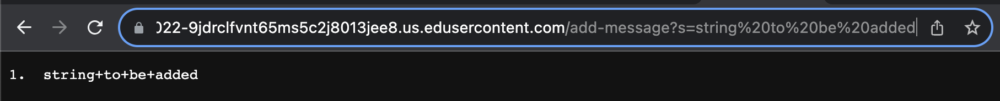
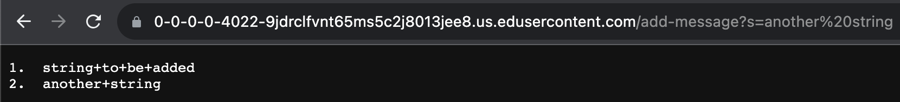
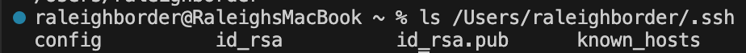
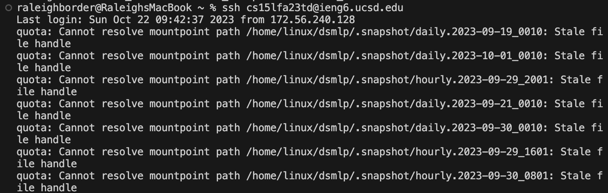
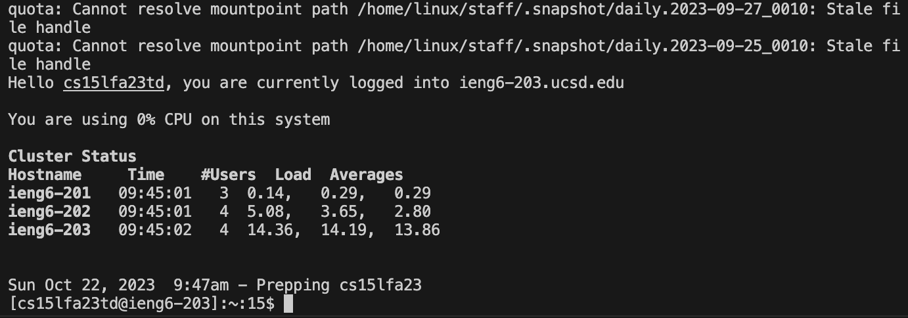
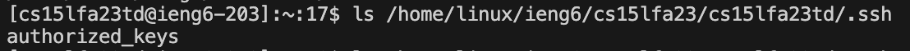

# Part 1
---
## StringServer
My code for the StringServer is as follows:
```
import java.io.IOException;
import java.net.URI;

class Handler implements URLHandler {
    // The one bit of state on the server: a string that will be manipulated by
    // various requests.
    String messages = "";
    int counter = 1;

    public String handleRequest(URI url) {
        if (url.getPath().equals("/")) {
            return messages;
        } else {
            if (url.getPath().contains("/add-message")) {
                String[] parameters = url.getQuery().split("=");
                if (parameters[0].equals("s")) {
                    messages += counter++ + ".  " + parameters[1] + "\n";
                    return messages;
                }
            }
            return "404 Not Found!";
        }
    }
}

class StringServer {
    public static void main(String[] args) throws IOException {
        if(args.length == 0){
            System.out.println("Missing port number! Try any number between 1024 to 49151");
            return;
        }

        int port = Integer.parseInt(args[0]);

        Server.start(port, new Handler());
    }
}
```
Here's some screenshots of it in action:


_When these links are accessed, the query is handled by the handleRequest method, which will make sure the right syntax is used, then append the string to the messages string, adding the proper formatting.  To give proper credit, this is highly derivative of the NumberServer we usded in class.  In order to handle the server end of things, I am also using the Server.java, which I don't believe I am expected to fully understand.  Oops if I was... :P_
---
## Part 2

_The above image shows the local path to both the public and private ssh keys.  These paths are /Users/raleighborder/.ssh/id_rsa.pub and /Users/raleighborder/.ssh/id_rsa respectively._



_The above images show the login process without a password.  I have cut it into two halves as to not fill the page with ... whatever all that stuff is._


_Now that I have logged in, we can see the remote key is stored at /home/linux/ieng6/cs15lfa23/cs15lfa23td/.ssh/authorized_keys_
