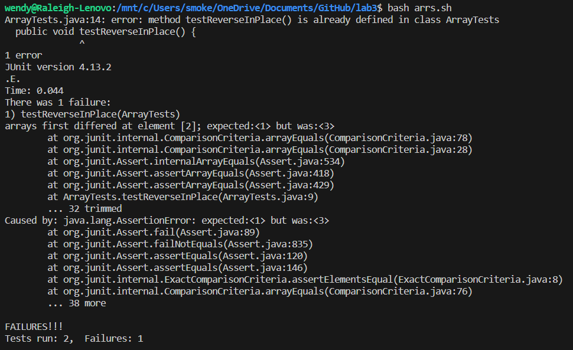
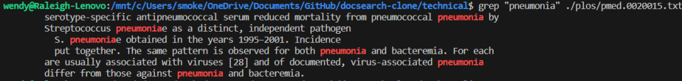
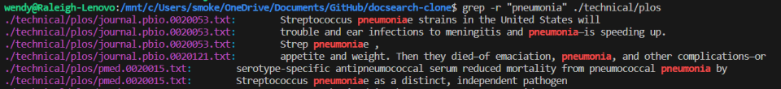
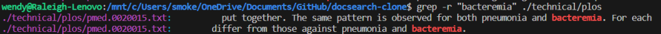
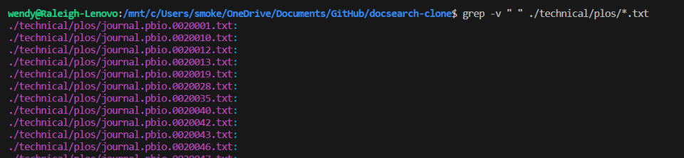
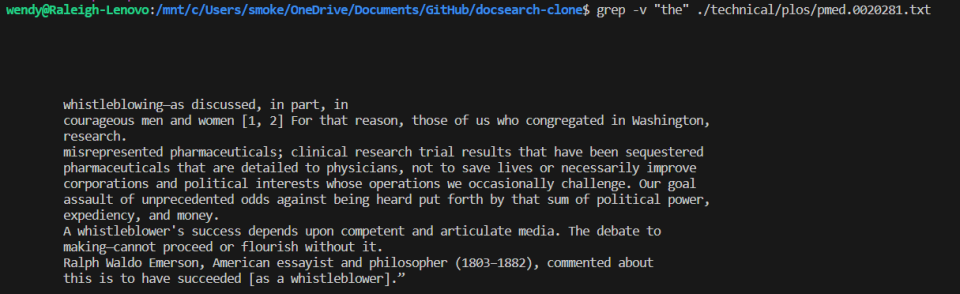
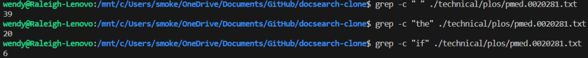
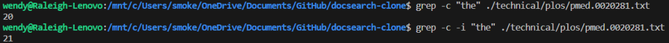
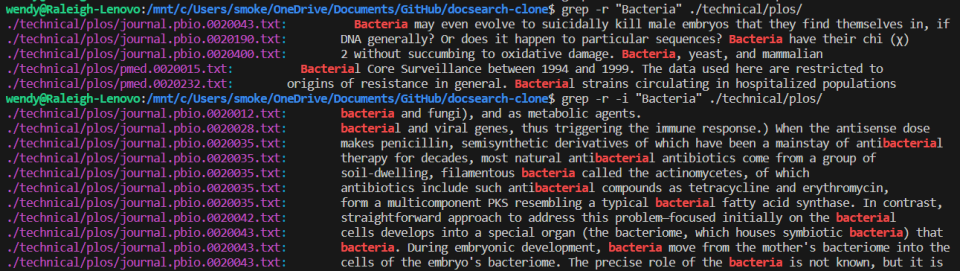

# Lab Report 3
---
## Part 1:
The buggy code I have chosen is the following,
```
static void reverseInPlace(int[] arr) {
  for(int i = 0; i < arr.length; i += 1) {
    arr[i] = arr[arr.length - i - 1];
  }
}
```
The failure inducing input is demonstrated by the following JUnit test,
```
@Test 
public void testReverseInPlace() {
  int[] input1 = {1, 2, 3};
  ArrayExamples.reverseInPlace(input1);
  assertArrayEquals(new int[]{3, 2, 1}, input1);
}
```
There is no failure for the following, very similar JUnit test,
```
@Test 
public void testReverseInPlace() {
  int[] input1 = {3};
  ArrayExamples.reverseInPlace(input1);
  assertArrayEquals(new int[]{3}, input1);
}
```
The symptom can be seen in the following screenshot,

The following is the now edited code to avoid the bug,
```
static void reverseInPlace(int[] arr) {
  int[] tempArr = new int[arr.length];
  for(int i = 0; i < arr.length; i++)
    tempArr[i] = arr[i];
  for(int i = 0; i < arr.length; i += 1) 
    arr[i] = tempArr[arr.length - i - 1];
}
```
The original method iterates forward through the array it is passed, replacing the first element with the last, then the second with the second to last, and so on.  This breaks when the loop gets to the second half of the array, since the first half has already been overwritten, so the data copied to the end of the array will be incorrect.  This is not picked up by the second JUnit test, as there is only one element in that array, so when it is replaced by itself there is no effect.  My fixed version works, because it first copies the given array to a second array, caled tempArr.  The original array is then iterated through, and the first element of the original array is set to the last element of the temp array, and then the second to the second to last, and so on.  There will be no overlapping issue, as the array being read from is not being changed.  
## Part 2:
The command I have chosen to do more research on is ```grep```.  The standard usage of the command is ```grep \[pattern] \[filename]```, an example of which can be seen below:

_This image shows grep being used to search the given file for "pneumonia", which has resulted in the output which highlights the search string in red._

One option for using grep is to use ```-r```, which recursively searches through files in a directory, rather than searching in one file specifically.  Here are a couple of examples:

_This shows grep searching through all files in the ```plos``` directory for the string, "pneumonia".  There are more results not shown, I just cut it off so this wouldn't fill the page.  This option is useful, as it is helpful to be able to search many files in case you don't remember which file the thing you are searching for is in, or in case it is in multiple files._

_This shows grep searching through all ```plos``` files again, this time looking for "bacteremia", which it finds two times.  Notice the path to the file it found on the left.  This is helpful for locating which file contains the search term._

Another option is ```-v```, which inverts the search to return everything excluding the given string.

_This image shows grep finding all lines in all ```.txt``` files in ```plos``` which do not contain a space.  These are all empty lines, which makes sense._

_This image shows grep finding all lines in the given file which do not contain the word, "the".  This could be useful, though in relatively specific circumstances.  An example could be a file which has bullet pointed lists formatted by " * ", maybe you want to see all lines which don't have bullet points._

The ```-c``` option gives a count of the lines which include the search string, rather than listing them explicitly.  The following image shows a few examples:

_This image shows grep searching the given file for " ", "the", and "if", returning a count of how many lines include each search term, rather than a list of matching results.  This is quite useful in many cases.  An example could be if you are trying to find the file which contains the most of a certain word or phrase, you could run the command on all files and see which number is highest._

The final option I looked at was the ```-i``` option.  This option allows a search to be performed case insensitively.  Here are some examples:

_This example uses -c as well to show a count rather than a massive list of lines, which makes it a bit clearer.  There are 20 lines on which "the" appears, and 21 case insensitively, meaning one line must have "The" and not "the"._

_This example showcases the capital B "Bacteria" appearances, followed by a search which returns case insensitive appearances of "Bacteria".  This is quite useful, as often case sensitivity is not necessary.  A person searching for a key term likely doesn't think of bacteria differently from Bacteria and would want both to show up._
All of the information I found on these options was using the man command in the terminal.  
