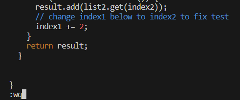

# Lab Report 4  

  
Keys pressed: `<up>`(x11)`<enter>`  
_The clone command was 11 commands back in the history, so I returned to it and ran it with `<enter>`._  

  
Keys pressed: `c d <space> l a <tab> <enter>`  
_Typing such a short command is likely easier than finding it in history, so I simply type the command, then use `<tab>` to autofill the correct directory name._  

  
Keys pressed: `b a s h <space> t <tab> <enter>`  
_Similar to cd, it is easier to just type bash, and then use `<tab>` to autofill test.sh._  

  
Keys pressed: `v i m <space> <shift>l <tab> . <tab> <enter>`  
_Pressing `<tab>` the first time only autofills ListExamples, so I must type `.` and then `<tab>` again to autofill the full ListExamples.java_  

  
Keys pressed: `4 3 <shift>4 <left> e r 2`  
_`44$` puts the cursor at the end of the line which must be edited, and `<left>` puts the cursor on the 1 which must be changed to a 2.  r2 replaces the character under the cursor with 2._  

  
Keys pressed: `<shift>; w q <enter>`  
_:wq saves the file and quits vim._  

  
Keys pressed: `<up> <up> <enter>`  
_`bash test.sh` was two commands back in the history, so two up arrow key presses to return to it, and enter to run it._  

  
Keys pressed: `g i t <space> a d <tab> <tab> <enter>`, `g i t <space> c o m <tab> - m <shift>' f i x e d <shift>'`, `g i t <space> p u s h`  
_These three commands add the edited file, make a commit with the message "fixed", and push to the repository. I use tab to complete add so that it also auto fills the space, which saves one keystroke :P_  
