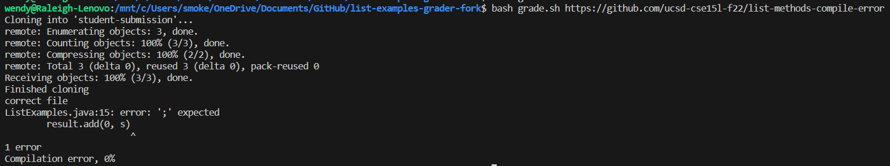

# Lab Report 5
---
## Original Post:

Hello, I'm having this strange issue with my grading script.  I want it to give the student a 0% for having a compilation error, but for some reason it is considering it to be 50%.  Wouldn't this mean it is succeeding at one of the two tests? I don't see how it could be possibly doing that if the submission does not even comple.  Thank you for any help.  
## TA's response:
Hey [student], have a look at how your script handles a compilation error.  Should it even get to the point where it is giving a grade?
## Student's new response:

Thank you TA!  I was able to find the bug, I had meant to avoid the grading part entirely, but it was not implemented properly.  I have since fixed this by putting all of the grading commands into an if statement, which will only execute if the exit code of the javac command is 0.  If not, the else statement will output the grade of 0.  Thank you!
